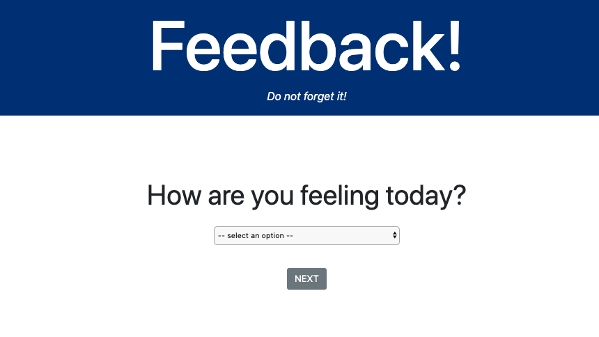
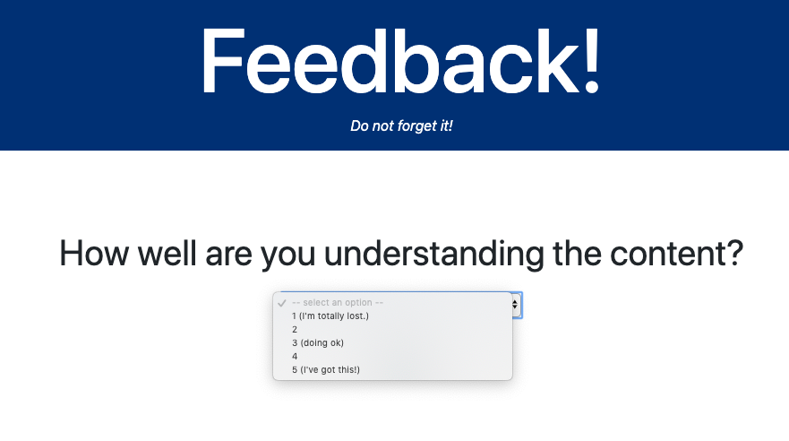
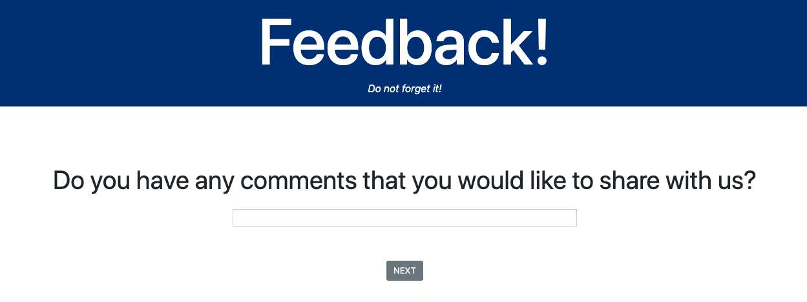
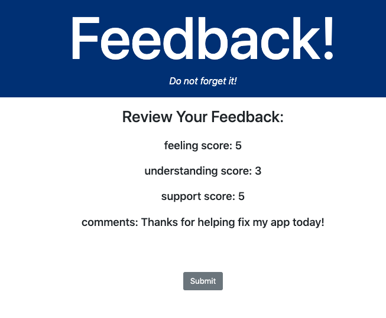
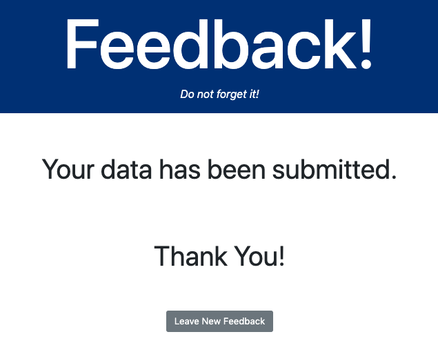

# Feedback Please App
This full-stack application allows an instructor to get daily feedback from their students. Student will enter a rating from a drop-down box, based on a specific measurement. They will also be asked for comments from a text field. Upon submit, students would be given a chance to review their data. After a final submit, a confirmation page would be reached with a link to start again.

### Technologies
YouTube API, JavaScript, React, Node.js, PostgreSQL, SQL, Express, React-Redux

### Getting Started
These instructions will get you a copy of the project up and running on your local machine.

### Prerequisites
Before you get started, make sure you have the following software installed on your computer:

- [Node.js](https://nodejs.org/en/)
- [PostrgeSQL](https://www.postgresql.org/)
- [Nodemon](https://nodemon.io/)

### Download this project.
- npm install
- Open the database.sql file in the repo. Create a feedback table in Postico
- Make sure the database is connected
- npm start server
- npm run client

### Feeling View

### Dropdown View

### Comments View

### Review View

### Confirmation View

